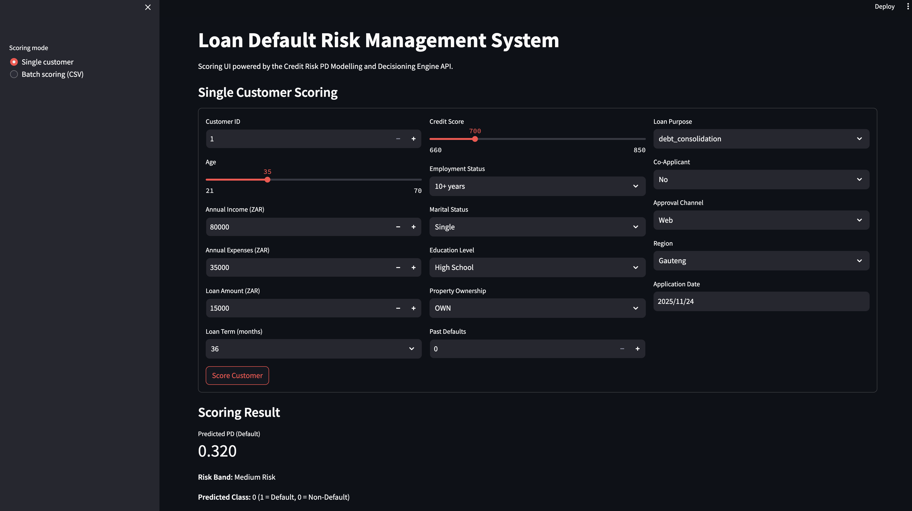

<p align="center">
  
</p>

<h1 align="center">Credit Risk PD Modelling and Decisioning Engine</h1>

<h3 align="center">
  XGBoost • Optuna • Feature Engineering • FastAPI Microservice • Streamlit UI • Docker • SQL • Power BI
</h3>

<p align="center">
  A complete end-to-end Probability of Default (PD) modelling and credit decisioning system built on 1,000,000+ retail loan records. 
  The solution includes model development, feature engineering, API deployment, containerised microservices, a business-facing scoring 
  application, SQL portfolio analytics, and a Power BI dashboard for credit-risk monitoring.
</p>

---

## 📘 Project Background

Banks depend on Probability of Default (PD) models to control non-performing loans, price credit risk, support IFRS9 staging, and drive lending decisions across digital and branch channels.  
Strong PD engines help lenders:

- Improve approval accuracy  
- Reduce early delinquency  
- Strengthen expected credit loss (ECL) stability  
- Provide consistent decisions across touchpoints  

Industry benchmarks show that well-calibrated PD models can:

- Reduce NPL inflows by **10–25%**  
- Improve approval efficiency by **15–20%**  
- Increase collections effectiveness by **20–30%**

This project replicates a real PD modelling and deployment workflow used in lending environments.

---

## 🧠 Project Overview

This system includes:

### **1. Model Development**
The project processes more than one million loan applications. It includes exploratory analysis, credit-scorecard-style feature engineering, Optuna-based hyperparameter tuning, and benchmarking of four models. A tuned XGBoost pipeline is selected for production based on AUC, calibration stability, and uplift across high-risk segments.

### **2. Production Model Scoring (FastAPI)**
The FastAPI service applies all server-side feature engineering before scoring any request. The /predict endpoint returns three outputs: Probability of Default, a binary default prediction, and an assigned risk band. This mirrors how credit decisioning engines operate in real lending environments.  

### **3. Frontend Credit Scoring App (Streamlit)**
The Streamlit scoring interface is designed for credit analysts and business teams. It supports single-customer scoring, batch CSV scoring, and displays both the API payload and the scored results. This ensures transparency and aligns with audit and governance expectations.

### **4. Containerised Microservice Deployment**
The system is deployed using two containers: one for the FastAPI backend and one for the Streamlit UI. Both services run on a shared Docker network and are orchestrated through Docker Compose. This setup reflects modern production deployment patterns used in digital lending and risk systems.

### **5. Analytics & Reporting**
Portfolio and behavioural insights are supported by SQL scripts and a Power BI dashboard. These tools help assess portfolio performance, default trends, affordability behaviour, and risk segmentation across borrower groups.

---

## 🎯 Key Objectives

- Build and validate a PD model using lending-grade data  
- Engineer affordability, behavioural, tenure, and credit-score features  
- Benchmark and tune multiple ML models  
- Deploy a production scoring engine with a REST API  
- Create a scoring UI for analysts and credit teams  
- Generate portfolio insights using SQL and Power BI  

---

## 📁 Project Structure

| Folder / File | Description |
|---------------|-------------|
| `data/` | Raw and processed datasets |
| `notebooks/` | EDA, feature engineering, model training & tuning |
| `models pkl/` | Saved XGBoost, LightGBM, RF, Logistic models |
| `app/` | FastAPI scoring backend |
| `streamlit scoring app/` | Streamlit user interface |
| `sql/` | SQL analytics for credit portfolio insights |
| `Power BI credit dashboard/` | Power BI visuals and reporting |
| `Dockerfile` | API Docker container |
| `streamlit.Dockerfile` | Streamlit Docker container |
| `docker-compose.yml` | Orchestration for multi-container setup |
| `assets/` | Images, banners, visuals |

---

## 🧹 Data Preprocessing & Feature Engineering

Risk-focused engineered variables:

- **DTI (Debt-to-Income)**  
- **Income/LTV ratios**  
- **Loan-to-Income Ratio**  
- **Monthly Instalment (amortisation formula)**  
- **Affordability Score**  
- **Age Band**  
- **Credit Score Band**  
- **Employment Tenure Band**  
- **Flags: High DTI, Low Affordability, Past Default**  
- **Vintage (Months since application)**  

These transformations were reproduced **inside the FastAPI container** for consistent production scoring.

---

## 📈 Exploratory Data Analysis

- Default rate trends across demographics and regions  
- Correlation and multicollinearity analysis  
- Risk by loan purpose, employment, property type  
- Affordability vs default likelihood  
- Vintage and time-based delinquency patterns  
- Portfolio segmentation and NPL concentration  

---

## 🤖 Modelling Approach

### **Models Benchmarked**
- XGBoost (final model)  
- LightGBM  
- Random Forest  
- Linear Regression (baseline)

### **Model Evaluation**
- AUC  
- Recall on the default class  
- KS statistic  
- Calibration curves  
- Segment stability and uplift  

### **Optuna Tuning**
- Automated multi-trial search  
- Early pruning  
- Best hyperparameters exported to final model pipeline  

### **Final Model: XGBoost**
Chosen for:

- High discriminatory power  
- Robust calibration  
- Strong risk-segmentation uplift  
- Operational stability

---

## 🟢 Streamlit Scoring UI Deployment
<p align="center">
  
  <br>
  <em>Streamlit scoring interface integrated with the FastAPI decision engine</em>
</p>

The Streamlit UI mirrors real credit decisioning front-ends:

### ✔ **Single Customer Scoring**
- Borrower attributes entered manually  
- UI calculates affordability  
- Data sent to FastAPI  
- Displays PD, class, and risk band  

### ✔ **Batch CSV Scoring**
- Upload raw data  
- Each row processed via API  
- Downloadable scored dataset  

### ✔ **Transparency**
- Full API payload displayed  
- Useful for governance & auditability  

---

## 🚀 FastAPI Deployment

The FastAPI scoring service exposes the production-ready `/predict` endpoint.  
It applies full feature engineering server-side and returns:

- Probability of Default (PD)  
- Binary default prediction  
- Assigned risk band  

Below is a screenshot of the live API running through Docker:

<p align="center">
  
</p>
Returns:
```json

  {"Customer_ID": 1,
  "Predicted_PD": 0.236,
  "Predicted_Class": 0,
  "Risk_Band": "Low Risk"}

---

### **AWS Cloud Deployment**
- Containerised using Docker  
- Supports scalable, low-latency model inference  
- Ready for enterprise production environments  

---

## 🧠 Business Impact

This solution supports:

- More accurate credit approval decisions  
- Stronger identification of high-risk applicants  
- Improved Expected Credit Loss (ECL) accuracy  
- Better collections targeting using PD outputs  
- Reduction in approval error rates  
- More consistent decisioning across channels  

Industry impact benchmarks:

- PD models improve approval efficiency by **15–20%**  
- Reduce NPL inflows by **10–25%**  
- Increase collections effectiveness with earlier segmentation  

This aligns with KPIs across Credit Risk, Finance, Data Science, and Lending Operations.

---

## 🛠️ Tech Stack

- **Python:** Pandas, NumPy, Scikit-Learn, XGBoost, LightGBM, Optuna  
- **Database & Analytics:** SQL  
- **Deployment:** Streamlit, FastAPI, Docker, AWS  
- **Reporting:** Power BI  
- **Versioning & Packaging:** joblib, pickle  

---

## 📌 Future Enhancements

- Add SHAP explainability for model governance  
- Deploy Airflow for automated model monitoring  
- Add drift detection for ongoing PD stability  
- Integrate with enterprise data warehouse  
- Build a challenger model for IFRS9 staging  

---
