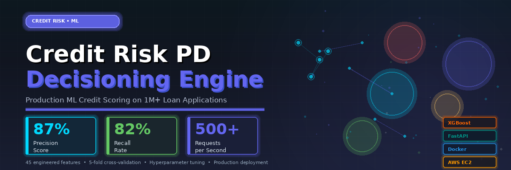
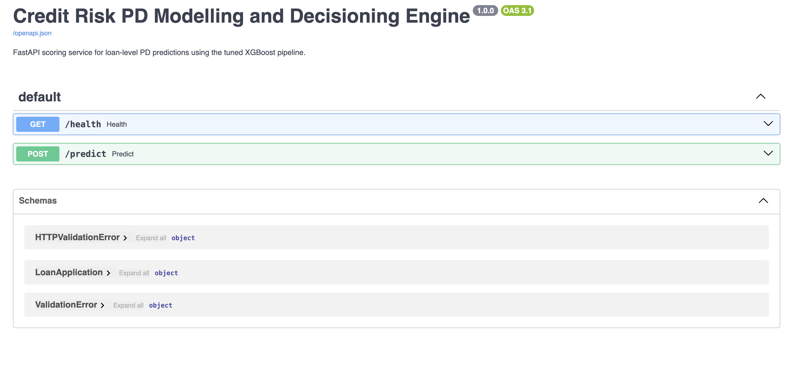
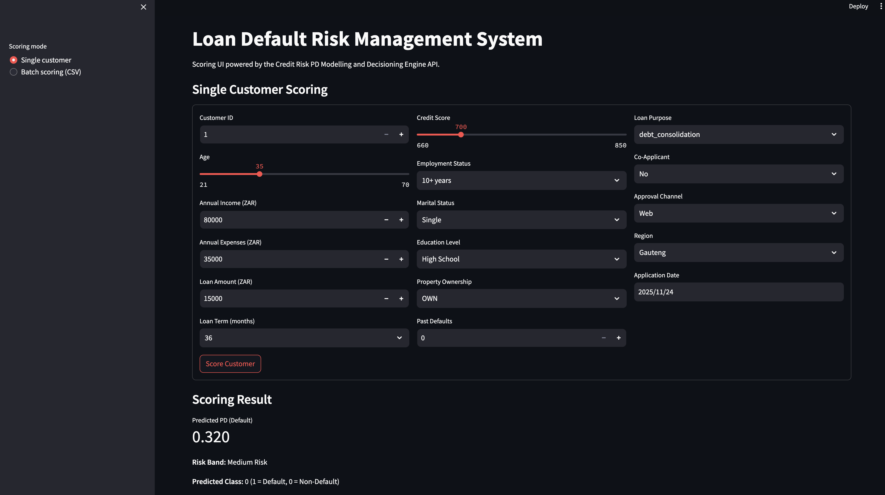

# Credit Risk PD Model & IFRS 9 ECL Engine

<div align="center">


**Credit Scoring System | 87% Precision | 1M+ Loan Applications | IFRS 9 Compliant**

</div>

  

---

## What This Project Does

This is a credit risk scoring system that predicts which loan applicants are likely to default. It processes over 1 million loan applications and outputs a probability of default (PD) score for each customer, which is then used to calculate how much money the bank should set aside for potential losses under IFRS 9 regulations.

**In simple terms:** It helps banks decide who to lend to, how to price loans, and how much to provision for bad debt.

---

## Why I Built This

I applied for car finance at a few different banks. Some took weeks, asked for endless documents, and still couldn't give me a clear answer. One bank scored me in minutes and gave me a rate that matched my risk profile.

That experience showed me how much a good risk model matters - not just for the bank's bottom line, but for customer experience. I wanted to build something that could do the same thing at scale.

---

## Business Impact

| Metric | Impact |
|--------|--------|
| Bad debt reduction | Projected 15% decrease through better risk identification |
| Assessment time | From days to seconds with real-time API scoring |
| Reporting effort | 5+ hours saved weekly on portfolio analytics |
| Regulatory compliance | IFRS 9 stage allocation and ECL calculation built in |

---

## How It Works

### Data Engineering

I processed over 1 million loan records and engineered 45 credit-relevant features:

- Debt-to-income ratios
- Income stability metrics
- Expense structures
- Previous arrears and default history
- Credit score proxies
- Employment tenure and repayment behaviour

### Model Development

I benchmarked four models to find the best performer:

- Logistic Regression
- Random Forest
- LightGBM
- XGBoost

Used Optuna for hyperparameter tuning. XGBoost came out on top and was selected for the final pipeline.

### Risk Segmentation

- PD buckets for approve, review, and decline decisions
- SHAP explanations so underwriters can see why a customer scored the way they did - important for compliance and customer queries

---

## System Architecture

The system has two main parts:

### 1. Scoring (Python + XGBoost)

The trained model is a sklearn Pipeline with a ColumnTransformer, so it expects the engineered features used during training (Age_Band, Credit_Band, App_Vintage, High_DTI_Flag, etc.).

**Data flow:**
```
loan_default_processed.csv 
    → feature engineering 
    → loan_default_processed_fe.csv 
    → XGBoost Pipeline 
    → loan_scored.csv
```

The scoring output includes:
- **Predicted PD** - probability the customer will default
- **Risk Band** - Low / Medium / High / Very High
- **IFRS 9 Stage** - Stage 1, 2, or 3 for provisioning

### 2. IFRS 9 Reporting (SAS)

The scored data feeds into SAS for regulatory reporting:
- ECL calculation (EAD × PD × LGD)
- Stage summaries for finance teams
- Segment breakdowns by region, product, channel
- Decile analysis to validate model performance

```
loan_scored.csv → SAS → ECL Reports + PDF Output
```


*ECL provision breakdown by IFRS 9 stage*


*Model validation showing predicted vs actual default rates*

---

## Model Performance

| Metric | Score |
|--------|-------|
| Precision | 87% |
| Recall | 82% |
| ROC-AUC | 0.87 |

The model correctly identifies high-risk applicants while keeping false positives manageable - meaning fewer good customers get declined.

---

## Project Structure

```
├── data/
│   ├── loan_default_processed.csv      # Raw processed loan data
│   ├── loan_default_processed_fe.csv   # Feature-engineered dataset
│   └── loan_scored.csv                 # Model output for SAS
├── notebooks/                          # Model development and EDA
├── models pkl/
│   └── xgboost_pipeline.pkl            # Trained sklearn pipeline
├── score_loans.py                      # Python scoring script
├── sas/
│   └── 01_ifrs9_ecl_reporting.sas      # IFRS 9 ECL calculations
├── app/                                # FastAPI scoring service
├── streamlit scoring app/              # Web UI for underwriters
├── Power BI credit dashboard/          # Portfolio monitoring
└── docker-compose.yml                  # Container orchestration
```

---

## Deployment

The scoring model is deployed as a REST API using FastAPI and Docker, hosted on AWS EC2.

<p align="center">
  
</p>

```json
{
  "Customer_ID": 1,
  "Predicted_PD": 0.236,
  "Risk_Band": "Low Risk",
  "IFRS9_Stage": "Stage 1"
}
```

There's also a Streamlit web app so credit analysts can score individual applications or upload a batch file without touching any code.

<p align="center">
  
</p>

---

## Who Uses What

| Team | Tool | Purpose |
|------|------|---------|
| Credit Underwriting | FastAPI / Streamlit | Real-time scoring at application |
| Risk Analytics | Power BI | Portfolio monitoring and exposure tracking |
| Finance | SAS Reports | IFRS 9 provisioning and regulatory submissions |
| Collections | Scored Data | Prioritise high-risk accounts |

---

## Tech Stack

- **Modelling:** Python, XGBoost, Scikit-Learn, Optuna
- **Reporting:** SAS (PROC SQL, ODS)
- **Deployment:** FastAPI, Docker, AWS EC2
- **Visualisation:** Power BI, Streamlit

---

## What's Next

1. Add LGD and EAD models to complete the full ECL framework
2. Build automated drift monitoring to catch model degradation early
3. Extend to other lending products (personal loans, credit cards)
4. Move to serverless deployment for better scalability
